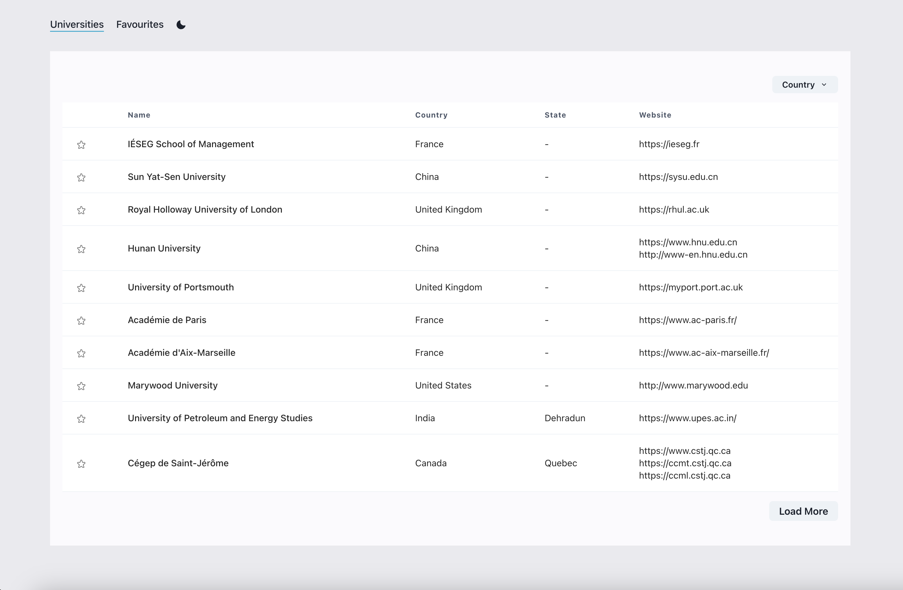

## Getting Started

1. Clone the repository locally:

```bash
  git clone https://github.com/thenotoriousjr/to-do-university.git
```

2. Navigate to the project directory and run `install` command to setup and install dependencies:

```bash
  yarn install
```

3. Start the project in development mode by running the following command:

```bash
  yarn start
```

You will be prompted to the page automatically at http://localhost:3000



Great. You now have your project running.

